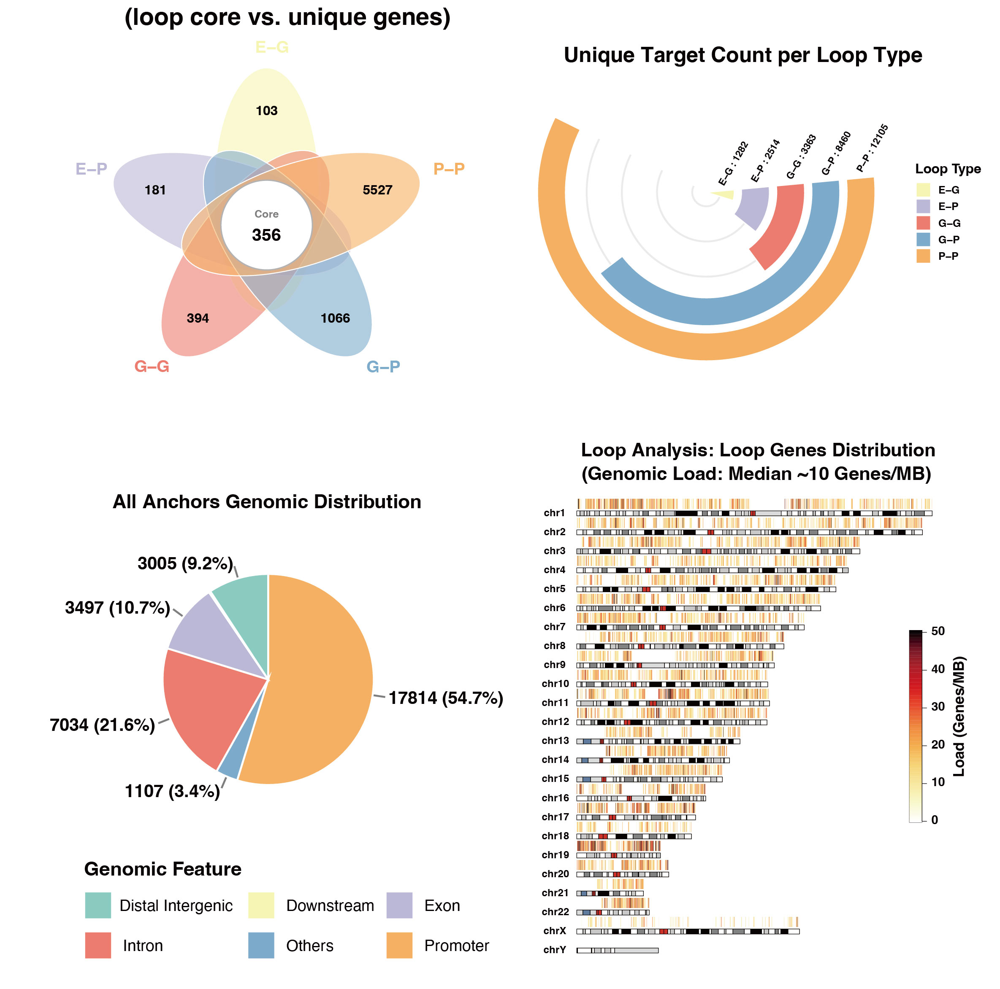
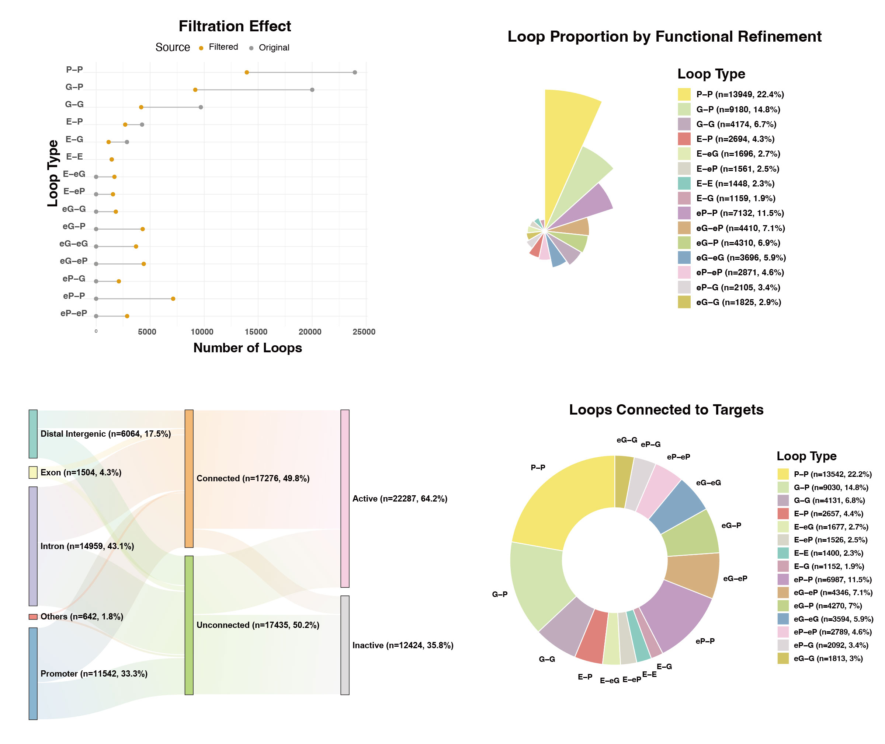
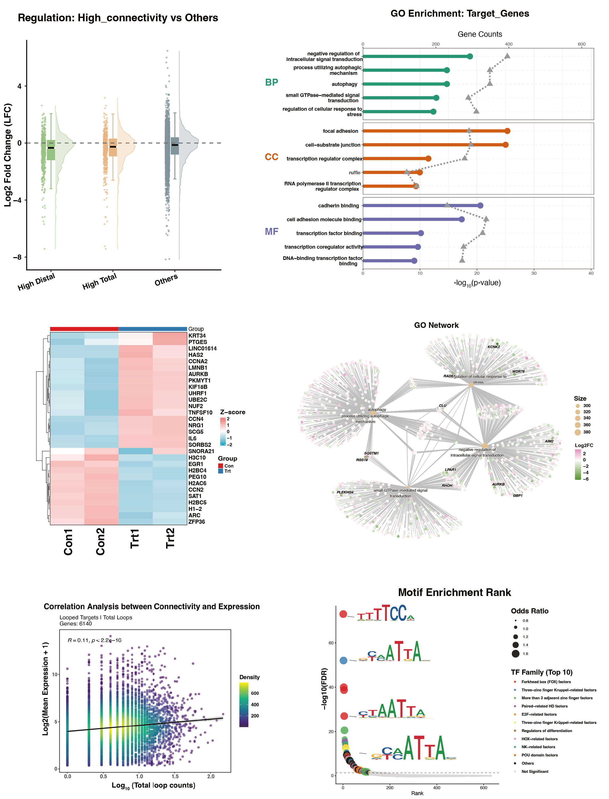
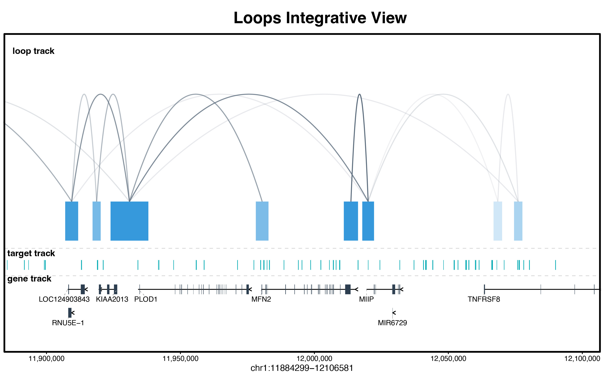

# looplook 

A multi-omics suite for expression-aware target assignment and topological profiling of 3D chromatin networks.

[](https://github.com/zying106/looplook/actions/workflows/R-CMD-check.yaml)
[](https://www.gnu.org/licenses/gpl-3.0)
[](#)
[](https://lifecycle.r-lib.org/articles/stages.html#stable)

<br>

---

## Introduction

Welcome to **`looplook`**, a highly sophisticated R/Bioconductor toolkit designed to decipher the complex interplay between **3D chromatin architecture** (e.g., HiChIP, ChIA-PET, Hi-C) and **1D multi-omics profiles** (including transcriptomics, chromatin accessibility, protein-DNA interactions via ChIP-seq/CUT&Tag, and genetic variants like GWAS SNPs).

The toolkit resolves a major bottleneck in functional genomics: accurately assigning non-coding variants or orphan peaks to their target genes. While traditional annotations rely on the *nearest linear gene* heuristic, this often fails to capture biological reality. Many distal regulatory elements physically contact target gene promoters via 3D chromatin interactions, regulating the expression of genes located tens of kilobases to megabases away.

`looplook` computationally bridges this critical 1D-to-3D gap at a **genome-wide, high-throughput scale**. It systematically prioritizes physical spatial contacts to batch-annotate thousands of regulatory elements, revealing their high-confidence putative target genes with unprecedented efficiency. 

Beyond its power as a spatial bridge, `looplook` serves as a standalone powerhouse for **intrinsic loop profiling**. Even without auxiliary 1D inputs, it systematically annotates the 3D interactome itself, classifying complex spatial topologies (e.g., Enhancer-Promoter, Promoter-Promoter) and calculating node connectivities to uncover dense **regulatory hubs** and super-enhancer cliques that drive cell-type-specific transcriptional programs.

---

## Installation

`looplook` heavily relies on the Bioconductor ecosystem for robust genomic arithmetic and annotation. Please ensure your environment is up to date:

```{r, eval = FALSE}
# 1. Install required annotation dependencies (Example for Human hg38)
if (!requireNamespace("BiocManager", quietly = TRUE)) install.packages("BiocManager")
BiocManager::install(c("TxDb.Hsapiens.UCSC.hg38.knownGene", "org.Hs.eg.db"))

# 2. Install looplook from GitHub
if (!requireNamespace("devtools", quietly = TRUE)) install.packages("devtools")
devtools::install_github("zying106/looplook")
```

---

## Detailed Workflow & Core Modules

### Module 1: Data Consolidation & Preprocessing
In 3D genomics, individual replicates often suffer from high noise. The `consolidate_chromatin_loops` function acts as the foundational data-cleaning engine, merging multiple replicates into a clean, unified 3D coordinate framework.

**Key Parameters:**

* `mode`: Defines the overarching merging algorithm. `"consensus"` (recommended) uses graph-based connected component analysis to group nearby anchors across samples. `"intersect"` applies strict reference-based filtering, while `"union"` retains all interactions for exploratory pan-tissue analysis.
* `min_raw_score` & `min_score` (The Dual-Filter): `min_raw_score` acts as a pre-filter applied to individual BEDPE files *before* clustering (e.g., removing singleton noise to drastically reduce memory overhead). `min_score` acts as a post-filter applied to the final merged interactome.
* `gap`: The maximum spatial distance (in base pairs) allowed between anchors to consider them part of the same physical cluster.
* `blacklist_species`: Automatically drops loops falling into high-variance, artifact-prone genomic regions (e.g., centromeres, telomeres) by seamlessly applying the official ENCODE blacklist (e.g., `"hg38"`, `"mm10"`).
* `region_of_interest`: By providing an auxiliary BED file (e.g., a specific disease locus or ChIP-seq peaks), the engine drops the global background and strictly outputs loops physically connected to this targeted zone.

```{r, eval = FALSE}
library(looplook)
out_dir <- tempdir()

# Execute consensus merging with strict Quality Control
consensus_global <- consolidate_chromatin_loops(
  files = c("rep1.bedpe", "rep2.bedpe"),
  mode = "consensus",
  gap = 1000,
  min_raw_score = 2,           # Pre-filter sequencing noise
  blacklist_species = "hg38",  # Apply ENCODE artifact blacklist
  out_file = file.path(out_dir, "consensus_loops.bedpe")
)
```

### Module 2: 3D-Guided Peak Annotation & Mapping
This module forms the core mapping engine. It seamlessly executes a rigorous hierarchical pipeline to resolve locus conflicts: *Expression Pre-filter $\rightarrow$ Functional Biotype Prioritization $\rightarrow$ Dominant Expression Tiebreaker*.

**Key Parameters:**

* `target_bed`: The 1D auxiliary features of interest (e.g., GWAS SNPs, ATAC-seq peaks, or ChIP-seq binding sites) that require spatial target assignment.
* `expr_matrix_file` & `sample_columns`: Providing an RNA-seq matrix allows the engine to activate the Expression Pre-filter and Tiebreaker logic, drastically reducing false-positive gene assignments in dense loci.
* `neighbor_hop`: A highly advanced topological parameter for network traversal. `0` strictly annotates direct physical contacts. `1` (Hub Mode) evaluates secondary network effects within super-enhancer cliques.
* `tss_region`: Defines the spatial boundary of a promoter relative to the Transcription Start Site (TSS).

```{r, eval = FALSE}
# Map 1D peaks to 3D loops and resolve multi-gene conflicts
res_integrated <- annotate_peaks_and_loops(
  bedpe_file = file.path(out_dir, "consensus_loops.bedpe"),
  target_bed = "atac_peaks.bed",
  expr_matrix_file = "rna_tpm.txt",
  sample_columns = c("con1", "con2"),
  species = "hg38",
  neighbor_hop = 0,
  hub_percentile = 0.95,
  out_dir = out_dir,
  project_name = "Integrative_Annotation"
)
```

**Output Data Dictionary: The Comprehensive 3D Spatial Catalog**
The module systematically exports a multi-layered tabular catalog (e.g., `*_Basic_Results.xlsx`) detailing the spatial interactome:

* **1D-to-3D Target Mapping (`target_annotation`)**: Delineates the spatial reach of user-inputted variants. It strictly differentiates `Assigned_Target_Genes` (targets derived exclusively via 3D physical loops) from `*_Filled` columns, which implement a "Smart Fallback" logic to nearest linear genes for unlooped loci, ensuring comprehensive, gapless coverage.
* **3D Network Architecture (`loop_annotation`)**: Resolves the biological syntax of the structural interactome. It classifies topological interactions (`loop_type`, e.g., E-P, P-P) and isolates biologically relevant `Putative_Target_Genes` from the broader, raw physical footprints (`All_Anchor_Genes`).
* **Topological Hub Detection (`promoter_centric_stats` & `distal_element_stats`)**: Quantifies structural node degrees (e.g., `n_Linked_Promoters`, `n_Linked_Distal`) to rigorously deconstruct the interactome from two complementary perspectives. `promoter_centric_stats` identifies core target genes orchestrated by complex regulatory landscapes (e.g., multi-enhancer arrays or transcription factories), while `distal_element_stats` highlights high-connectivity non-coding regions to facilitate the discovery of putative super-enhancer cliques.

<div align="center">
  
  <p><em>Figure 1: <strong>Representative outputs of 3D-Guided Annotation.</strong> This composite visualization showcases a curated subset of the automated profiling suite, featuring macro-scale chromosomal ideograms and topological overlap profiling of the annotated 3D interactome.</em></p>
</div>

### Module 3: Expression-Aware Refinement
Physical proximity is a structural prerequisite, but not a direct proxy for active gene regulation. This module integrates quantitative transcriptome data to systematically eliminate transcriptionally silent physical contacts.

**Key Parameters:**

* `threshold` & `unit_type`: Defines the quantitative cutoff (e.g., `threshold = 1.0`, `unit_type = "TPM"`) required to consider a gene biologically active, allowing downward compatibility with various normalization methods.
* `reclassify_by_expression`: When enabled (`TRUE`), mathematically silent Promoters are not simply discarded; they are biologically downgraded to enhancer-like regulatory elements. This corrects the regulatory syntax (e.g., transitioning a functionally silent `P-P` loop into a biologically accurate `eP-P` loop).

```{r, eval = FALSE}
# Expression-Aware Reclassification (Recommended)
refined_res <- refine_loop_anchors_by_expression(
  annotation_res = res_integrated,
  expr_matrix_file = "rna_tpm.txt",
  sample_columns = c("con1", "con2"),
  threshold = 1.0,
  unit_type = "TPM",
  reclassify_by_expression = TRUE, 
  out_dir = out_dir,
  project_name = "Refined_Network"
)
```

**Output Data Dictionary: The Functionally Active Regulome**
Following transcriptome integration, the refined tabular outputs represent a high-confidence, functionally active subset of the original interactome:

* **Expression-Aware Filtration**: The resulting catalog explicitly excludes pure structural loops lacking functional transcriptional output, yielding a purely active regulatory network.
* **Dynamic Topological Reclassification**: The structural syntax within the `loop_type` annotations is biologically recalibrated. By dynamically downgrading transcriptionally silent promoters (`P`) to enhancer-like elements (`eP`), the catalog fundamentally corrects the spatial regulatory syntax (e.g., seamlessly transforming a mathematically silent `P-P` loop into a functionally accurate `eP-P` interaction axis).

<div align="center">
  
  <p><em>Figure 2: <strong>Representative outputs of Expression-Aware Refinement.</strong> Highlighting the Multi-Omics Sankey Tracking, this selected visualization dynamically maps the ultimate fate of 1D variants through 3D topologies into transcriptionally active targets.</em></p>
</div>

### Module 4: Automated Functional Profiling
A fully automated, end-to-end multi-omics analysis pipeline that bridges 3D genomic interactions with transcriptomic data to unveil the regulatory mechanisms of your targets.

**Key Parameters:**

* `target_source` (The Biological Scope): `"targets"` focuses exclusively on the putative genes regulated by inputted 1D features (Peak-Centric). `"loops"` evaluates the entire 3D interactome independent of 1D peaks (Global Network-Centric).
* `target_mapping_mode`: `"all"` accepts broad 3D target regulation. `"promoter"` is highly stringent, strictly enforcing that the 3D loop must explicitly anchor at a canonical Promoter region (excluding E-G connections).
* `include_Filled` (The Stringency Toggle): `TRUE` (Hybrid Mode) utilizes the comprehensively merged annotation, prioritizing 3D loop-derived targets but rescuing unlooped 1D peaks by assigning them to nearest linear genes. `FALSE` (Pure Spatial Mode) strictly isolates the 3D interactome.
* `use_nearest_gene` (The Control): If `TRUE`, it bypasses spatial topology and strictly assigns features to nearest 1D linear genes, serving as a classical baseline reference to demonstrate the novel functional insights gained by 3D mapping.

```{r, eval = FALSE}
# Comprehensive Integrative Profiling (RNA-seq + Spatial Hubs + JASPAR + GO/PPI)
res_profile <- profile_target_genes(
  annotation_res = refined_res,
  diff_file = "deseq2_res.txt",
  lfc_col = "log2FoldChange",
  expr_matrix_file = "rna_tpm.txt",
  metadata_file = "sample_metadata.txt",
  target_source = c("loops", "targets"),
  target_mapping_mode = "all",
  include_Filled = TRUE,
  use_nearest_gene = FALSE,
  project_name = "Functional_Profiling",
  out_dir = out_dir,
  run_motif = TRUE, 
  run_go = TRUE,
  run_ppi = TRUE
)
```

<div align="center">
  
  <p><em>Figure 3: <strong>Representative outputs of Functional Profiling.</strong> This curated composite highlights Divergent Concept Networks and Asymmetric Motif Signatures, offering a partial glimpse into the downstream visualizations that decode the trans-regulatory logic of the spatial hubs.</em></p>
</div>

### Module 5: IGV-Style Track Visualization
Precisely renders the local spatial interactome via a multi-tiered genomic browser view.

**Key Parameters:**

* `score_to_alpha`: Logical. If `TRUE`, maps the quantitative interaction score to the alpha (transparency) channel of the Bezier arcs, visually differentiating interaction strengths.
* `species`: Directs the function to automatically load the corresponding `TxDb` and `OrgDb` Bioconductor packages for precise gene track rendering (mapping exons and introns with strand directionality).

```{r, eval = FALSE}
library(ggplot2)

# Generate an integrative multi-omics locus track
track_plot <- plot_peaks_interactions(
  bedpe_file = file.path(out_dir, "consensus_loops.bedpe"),
  target_bed = "atac_peaks.bed",
  chr = "chr1",
  from = 11884299,
  to = 12106581,
  species = "hg38",
  save_file = file.path(out_dir, "Locus_Track.pdf")
)
print(track_plot)
```

<div align="center">
  
  <p><em>Figure 4: Integrative genomic browser view displaying 3D chromatin loops, 1D BED peaks, and directional gene models.</em></p>
</div>
---

## Contact

**Ying Zhang**
Zhejiang University  
Email: 12207129@zju.edu.cn

For bug reports, feature requests, or questions regarding the package, please open an issue at the [looplook GitHub repository](https://github.com/zying106/looplook/issues).

---

## Session Information

For reproducibility, `looplook` is developed and tested under the following environment:

```{r session_info, eval = TRUE, echo = FALSE}
sessionInfo()
```
