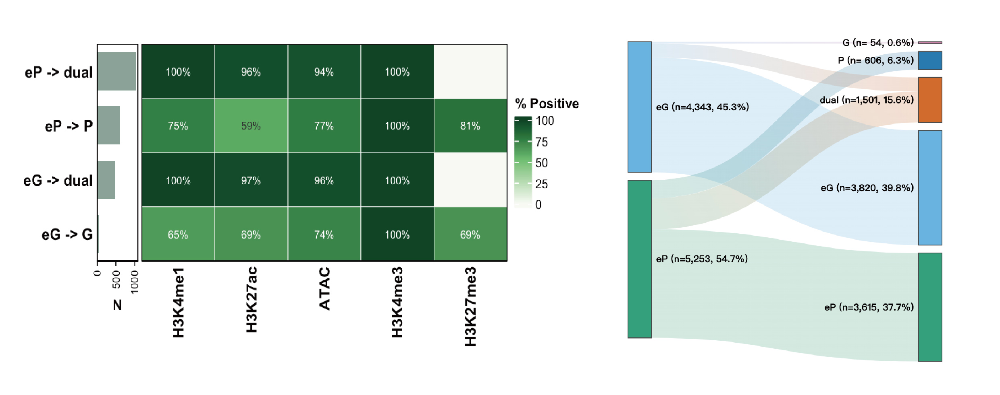

# looplook 

An integrative suite for target assignment and functional annotation of
chromatin interactions.

[](https://github.com/zying106/looplook/actions/workflows/R-CMD-check.yaml)
[](https://www.gnu.org/licenses/gpl-3.0)
[](#)
[](https://lifecycle.r-lib.org/articles/stages.html#stable)

------------------------------------------------------------------------

## Introduction

Welcome to **`looplook`**, a versatile R/Bioconductor toolkit developed
to **integrate 3D chromatin architecture data** (e.g., HiChIP, ChIA-PET,
Hi-C) with **other tabular omics datasets**, including transcriptomics,
chromatin accessibility, protein-DNA interactions (derived from
ChIP-seq, CUT&Tag, or CUT&RUN), and genetic variants annotated by
genome-wide association studies.

Numerous studies have demonstrated that many distal regulatory elements
physically interact with target gene promoters via 3D chromatin
loopings, thereby regulating the expression of genes located tens of
kilobases to megabases away in the linear genome. However, conventional
annotations tend to assign putative elements (peaks) to their **nearest
genes in cis**, which often fails to reflect biological reality. Hence,
the accurate assignment of non-coding genetic variants or orphan peaks
to their cognate target genes remains a major bottleneck in the target
annotation of functional elements. To address this, `looplook`
systematically prioritizes **physical spatial chromatin contacts** to
batch-annotate thousands of regulatory elements at a **genome-wide**,
**high-throughput scale**, thereby identifying their candidate target
genes with high confidence and systematic efficiency.

Beyond its utility as a tool for integrative target annotation,
`looplook` can be used as a **standalone utility for loop analysis** per
se. Even in the absence of auxiliary omics data, it systematically
annotates the 3D chromatin interactome itself, **classifying complex
spatial topologies** (e.g., Enhancer-Promoter, Promoter-Promoter
interactions) and **quantifying node connectivity** to uncover **dense
regulatory hubs and enhancer cliques** that may represent candidate
regulatory domains driving cell-type-specific transcriptional programs.

## A Triple-Layer Annotation Framework

`looplook`’s core methodological contribution is a **three-layer
orthogonal annotation framework** that classifies each loop anchor — the
fundamental unit connecting 3D contacts to downstream peak and feature
annotation — by integrating independent categories of experimental
evidence:

- **Genomic annotation** provides the baseline anchor assignment from
  genomic coordinates.
- **Expression-aware refinement** adds transcriptional-activity context.
- **Chromatin-Aware Refinement** supplies orthogonal histone-mark
  validation.

These anchor-level classifications propagate through the loop network to
determine target-gene assignments for every auxiliary feature (ChIP-seq
peaks, ATAC-seq regions, GWAS variants). Because the layers function
independently, users may deploy **any subset matched to their available
data modalities** — a single layer for exploratory annotation, two for
partial orthogonal support, or all three for maximally resolved
regulatory-element classification.

                                      ┌───────────────────────────┐
                                      │    GENOMIC ANNOTATION     │
                                      │    Genomic coordinates    │
                                      │  (TSS/gene-body overlap)  │
                                      │                           │
                                      │     "Where is it?"        │
                                      │     → P / G / E           │
                                      └─────────┬─────┬───────────┘
                                                │     │
                                   ┌────────────┘     └───────────┐
                                   ▼                              ▼
                       ┌──────────────────────────┐       ┌───────────────────────────┐
                       │  EXPRESSION REFINEMENT   │       │CHROMATIN RECLASSIFICATION │
                       │  Transcriptomic data     │       │     Chromatin state       │
                       │  (CAGE-seq, RNA-seq,     │       │  (ChIP-seq, CUT&Tag,      │
                       │   TT-seq, SLAM-seq)      │──────▶│   ATAC-seq)               │
                       │                          │       │                           │
                       │     "Is it active?"      │       │     "What is it?"         │
                       │    → eP / eG (silenced)  │       │  → dual / P / E corrected │
                       └──────────┬───────────────┘       └──────────┬────────────────┘
                                  │                                  │
                                  └────────────────┬─────────────────┘
                                                   │
                                Three layers = one integrated workflow
                          each adds orthogonal evidence; must follow annotation
                             → expression → chromatin order when combined

------------------------------------------------------------------------

## Installation

`looplook` extensively leverages the Bioconductor ecosystem for **robust
genomic arithmetic and annotation**. To ensure optimal compatibility,
please ensure your **system environment** is fully up to date prior to
installation:

``` r
# Installation from GitHub
if (!requireNamespace("BiocManager", quietly = TRUE)) install.packages("BiocManager")
BiocManager::install("zying106/looplook")
```

------------------------------------------------------------------------

## Detailed Workflow & Core Modules

### Module 1: Data Consolidation & Preprocessing

In 3D genomics analyses, individual replicates typically exhibit
**certain degrees of inconsistency or noise**. The
`consolidate_chromatin_loops` function serves as the foundational
data-cleaning module, merging multiple replicates into a **standardized,
unified 3D chromatin interaction coordinate framework**.

**Key Parameters:**

- **`mode`**: Defines the overarching merging algorithm. The
  **`"consensus"`** mode (recommended) **employs graph-based connected
  component analysis** to cluster nearby chromatin loop anchors across
  biological/technical samples. The **`"intersect"`** mode applies
  strict reference-based filtering to retain only overlapping
  interactions, while the **`"union"`** mode retains all detected
  interactions for **exploratory pan-tissue analyses**.
- **`min_raw_score` & `min_score`** (The Dual-Filter): `min_raw_score`
  acts as a **pre-filter** applied to individual BEDPE files before
  clustering (e.g., removing singleton noise to help reduce
  computational memory overhead). `min_score` serves as a
  **post-filter** applied to the final merged chromatin interactome to
  improve confidence. In `"consensus"` and `"union"` modes, the
  representative score is **replicate-balanced**: the package first
  averages clustered loop scores within each replicate, then averages
  across replicates, so one replicate with denser loop calls does not
  dominate the final score.
- **`gap`**: Defines the **maximum spatial distance** (in base pairs)
  allowed between loop anchors for consideration as part of the same
  physical cluster.
- **`chaining_policy`**: Controls how transitive chaining (A-B and B-C
  merging A-C into the same cluster) is handled. `"warn"` (default):
  emits a warning when any cluster span exceeds the chaining threshold;
  does not remove affected clusters. `"none"`: silent chaining allowed.
  `"drop"`: excludes wide chained clusters from output. `"error"`: stops
  with an error.
- **`blacklist_species`**: Automatically excludes chromatin loops
  overlapping with high-variance, artifact-prone genomic regions (e.g.,
  centromeres, telomeres) by integrating the official ENCODE blacklist
  for specified species (e.g., `"hg38"`, `"mm10"`).
- **`region_of_interest`**: Accepts an **auxiliary BED file** (e.g., a
  specific disease-associated locus or ChIP-seq peak set) to filter for
  loops with physical connectivity to the target genomic region.

``` r
library(looplook)
out_dir <- tempdir()

f1 <- system.file("extdata", "example_loops_1.bedpe", package = "looplook")
f2 <- system.file("extdata", "example_loops_2.bedpe", package = "looplook")

consensus_global <- consolidate_chromatin_loops(
  files = c(f1, f2),
  mode = "consensus",
  gap = 1000,
  out_file = file.path(out_dir, "consensus_loops.bedpe"),
  quiet = TRUE
)
```

### Module 2: 3D-Guided Peak Annotation & Mapping

This module serves as the **core target mapping engine**. It resolves
locus assignment conflicts through a rigorous hierarchical pipeline:
Functional Biotype Prioritization → Expression Filtering (within
selected tier) → Co-Dominant Expression Tiebreaker (retains all genes
with expression at least 10% of the group maximum (within a 10-fold
range)). The biotype priority order can be customised via the
`biotype_order` parameter (five keywords: `protein`, `small_ncRNA`,
`antisense`, `lncRNA`, `pseudogene`). For advanced control,
`resolve_gene_conflicts()` exposes the full conflict-resolution logic as
a standalone function.

**Key Parameters:**

- **`target_bed`**: Specifies the **auxiliary genomic features of
  interest** (e.g., GWAS SNPs, ATAC-seq peaks, or transcription factor
  binding sites) that require spatial target gene assignment.
- **`expr_matrix_file` & `sample_columns`**: Providing an RNA-seq matrix
  allows the engine to activate the Expression Pre-filter and Tiebreaker
  logic, drastically reducing false-positive gene assignments in
  **genomic regions harboring multiple genes**.
- **`biotype_order`**: Custom ordering of biotype categories for
  conflict resolution. Default:
  `c("protein", "small_ncRNA", "antisense", "lncRNA", "pseudogene")`.
  Set `c("lncRNA", "protein")` to prioritise lncRNAs.
- **`neighbor_hop`**: An advanced topological parameter for 3D chromatin
  interactome network traversal. Target gene assignment uses
  `neighbor_hop + 1` graph steps to capture genes at opposite anchors.
  `0` (default) restricts to direct contacts (target genes within
  1-hop). `1` additionally includes 2-hop expanded targets for
  exploratory network analysis. Values greater than `1` are not
  supported.
- **`hub_metric`**: Which connectivity count to use for hub detection.
  `"unique_contacts"` (default): counts distinct neighbour anchor IDs,
  robust to duplicate/replicate loop rows. `"total_loops"`: counts all
  loop rows (backward compatible; may inflate hub calls with
  unconsolidated replicates).
- **`target_priority`**: Policy for prioritising multiple candidate
  target genes per feature. Applies only within primary target links
  (default `path_length <= 1`); longer paths are reported separately as
  `Expanded_Target_Genes` and do not compete for
  `Assigned_Target_Genes`. `"promoter_then_distance"` (default): within
  primary links, promoter-linked genes beat gene-body genes, with
  shorter paths breaking ties. `"distance_then_role"`: path-length
  dominates — the closest linked gene wins; at equal distance, promoter
  beats gene-body (legacy behaviour).
- **`tss_region`**: Defines the **spatial boundary of gene promoters**
  relative to the Transcription Start Site (TSS).

``` r
# Annotate chromatin loops and map features to target genes via 3D contacts
# When TxDb/OrgDb are installed, runs the full pipeline; otherwise loads pre-computed result
if (requireNamespace("TxDb.Hsapiens.UCSC.hg38.knownGene", quietly = TRUE) &&
  requireNamespace("org.Hs.eg.db", quietly = TRUE)) {
  bedpe_file <- system.file("extdata", "example_loops_1.bedpe", package = "looplook")
  atac_path <- system.file("extdata", "example_peaks.bed", package = "looplook")
  expr_path <- system.file("extdata", "example_tpm.txt", package = "looplook")

  res_integrated <- annotate_peaks_and_loops(
    bedpe_file       = bedpe_file, # Chromatin loops (BEDPE)
    target_bed       = atac_path, # Genomic features to map
    expr_matrix_file = expr_path, # RNA-seq expression matrix
    sample_columns   = c("con1", "con2"), # Samples for baseline expression
    species          = "hg38",
    neighbor_hop     = 0, # Direct contacts only
    hub_percentile   = 0.95, # Top 5% as regulatory hubs
    out_dir          = out_dir,
    project_name     = "HiChIP_Integrative",
    quiet            = TRUE
  )
} else {
  tmp <- new.env()
  load(system.file("extdata", "analysis_results.RData", package = "looplook"), envir = tmp)
  res_integrated <- tmp[[ls(tmp)[1]]]
}
```

**Output Data Dictionary: The Comprehensive 3D Spatial Catalog**

The module exports a multi-layered tabular catalog (e.g.,
`*_Basic_Results.xlsx`) detailing the spatial interactome:

- **Integrative Target Mapping (`target_annotation`)** Delineates the
  spatial coverage of genomic variants/features inputted by the user. It
  separates strict loop-derived columns (`Regulated_promoter_genes`,
  `Assigned_Target_Genes`) from `*_Filled` fallback columns, and records
  provenance through `Regulated_promoter_Evidence`,
  `Regulated_promoter_Fallback_Evidence`, and the long-format
  `target_gene_links` table. This keeps promoter-supported loop targets,
  historical assigned targets, and nearest-gene fallback choices
  traceable rather than conflated.

- **3D Network Architecture (`loop_annotation`)** Resolves the
  biological syntax of the structural interactome. It classifies
  topological interactions (loop_type, e.g., E-P, P-P) and distinguishes
  biologically relevant `Putative_Target_Genes` from the broader, raw
  physical interaction footprints (`All_Anchor_Genes`).

- **Topological Hub Detection** Quantifies structural node degrees
  (e.g., `n_Linked_Promoters`, `n_Linked_Distal`) to deconstruct the 3D
  interactome from two complementary perspectives:
  **`promoter_centric_stats`**: Identifies core target genes regulated
  by **complex regulatory architectures** (e.g., enhancer arrays or
  transcription factories), while **`distal_element_stats`** highlights
  high-connectivity non-coding regions to facilitate the discovery of
  putative enhancer cliques.

<div align="center">


<p>

<em>Figure 1: <strong>Representative outputs of 3D-Guided
Annotation.</strong> This composite plot displays a curated subset of
the automated profiling suite, featuring macro-scale chromosomal
ideograms and topological overlap analysis of the annotated 3D
interactome.</em>
</p>

</div>

### Module 3A: Expression-Aware Refinement

Physical proximity is a structural prerequisite, but not a direct proxy
for active **transcriptional regulation**. This module integrates
quantitative transcriptome data to annotate each loop with
expression-aware functional status. All structural loops are preserved;
the pipeline reclassifies silent anchors (P to eP, G to eG), flags which
loops belong to the expression-supported functional subset
(`Retained_In_Functional_Network`), and exposes `Refinement_Action` for
transparent interpretation.

**Key Parameters:**

- `threshold` & `unit_type`: Defines the quantitative expression cutoff
  (e.g., `threshold = 1.0`, `unit_type = "TPM"`); genes with expression
  \>= `threshold` are considered active.
- `threshold_mode` (new): `"absolute"` (default): `threshold` is a
  direct expression cutoff. `"quantile"`: `threshold` is a quantile of
  the expression distribution (e.g., `0.75` selects the top 25% most
  highly expressed genes), adapting to different sequencing depths.
- `reclassify_by_expression`: When enabled (`TRUE`), **transcriptionally
  silent promoters** are not simply discarded; instead, they are
  biologically reclassified to enhancer-like regulatory elements. This
  correction refines the **regulatory topology** (e.g., reclassifying a
  functionally silent **P-P** loop into a curated **eP-P** loop).
  **Important:** `eP`/`eG` labels indicate transcriptional silence, not
  functional enhancer activity. Orthogonal chromatin data are required
  for functional interpretation.

``` r
expr_path <- system.file("extdata", "example_tpm.txt", package = "looplook")

refined_res <- refine_loop_anchors_by_expression(
  annotation_res = res_integrated,
  expr_matrix_file = expr_path,
  sample_columns = c("con1", "con2"),
  threshold = 1,
  unit_type = "TPM",
  reclassify_by_expression = TRUE,
  out_dir = out_dir,
  project_name = "Refined_Network",
  quiet = TRUE
)
```

**Output Data Dictionary: The Functionally Active Regulome** Following
transcriptome integration, the refined tabular outputs represent an
expression-supported, functionally active subset of the initial 3D
chromatin interactome. The **key features** of these output are as
follows:

- **Expression-Aware Refinement**: All structural loops are preserved.
  The pipeline annotates each loop with expression-aware functional
  status (`Has_Active_Target`, `Retained_In_Functional_Network`,
  `Refinement_Action`) and provides an expression-supported functional
  subset for downstream analysis, without discarding structural
  evidence.
- **Dynamic Topological Reclassification**: The topological annotations
  within the `loop_type` are biologically recalibrated. By dynamically
  reclassifying transcriptionally silent promoters (**P**) as
  enhancer-like elements (**eP**), the catalog fundamentally corrects
  the spatial regulatory syntax (e.g., transforming a silent **P-P**
  loop into an **eP-P** interaction axis).
- **Filtered Target Gene Links**: The refined provenance sheet retains
  only peak-gene links still used by the refined target columns and
  appends `Mean_Expression` plus `Passes_Expression_Filter`, so inactive
  Basic-stage links are not carried forward as active refined evidence.

The `eP` and `eG` labels denote expression-inactive promoter- or
gene-body-associated anchors treated as distal-like regulatory anchors
for network syntax. These should not be interpreted as experimentally
validated enhancers without additional epigenomic evidence (e.g.,
ATAC-seq accessibility, H3K27ac enrichment).

<div align="center">


<p>

<em>Figure 2: <strong>Representative outputs of Expression-Aware
Refinement.</strong> As shown by the Multi-Omics Sankey Tracking, this
curated visualization dynamically traces the fate of peak through 3D
chromatin topological interactions to their corresponding
transcriptionally active target genes.</em>
</p>

</div>

### Module 3B: Chromatin-Aware Refinement

While expression data identify transcriptionally active anchors,
orthogonal chromatin marks (ChIP-seq, CUT&Tag, ATAC-seq) provide
orthogonal chromatin-state evidence of regulatory element identity.
Module 3B offers two complementary functions for chromatin-based anchor
validation:

**`validate_epeG_by_chromatin()`** — Tests eP/eG (or P/G/E) anchors
against user-supplied chromatin mark BED files. Each anchor is scored
against ENCODE-inspired active-enhancer criteria: `canonical` (H3K4me1+,
H3K27ac+, ATAC+, H3K4me3-, H3K27me3-), `strong`, `supported`, limited,
or `uncertain`.

**`refine_loop_anchors_by_chromatin()`** — Applies chromatin-mark
evidence to **reclassify** anchors and update loop topologies.
H3K4me3-positive anchors default to P or G; dual-signature elements are
identified when bigWig evidence supports H3K4me1 dominance
(H3K4me1/H3K4me3 ≥ 3 via `chromatin_bw`) or overlap with a curated
enhancer BED (`enhancer_bed`). Also supports: P + enhancer marks → `E`;
eP/eG + promoter marks → `P` (H3K4me3+ inside a gene body → alternate
TSS); E + H3K4me3 only → `P` (unannotated promoter). Supports
`recompute_targets = TRUE` to rebuild target gene links with updated
anchor types, producing chromatin-aware `target_annotation` and
`target_gene_links`.

``` r
# Validate eP/eG anchors against chromatin marks
val <- validate_epeG_by_chromatin(
  annotation_res = refined_res,
  chromatin_beds = list(
    H3K4me1  = "H3K4me1_peaks.bed",
    H3K27ac  = "H3K27ac_peaks.bed",
    ATAC     = "atac_peaks.bed"
  )
)
table(val$enhancer_evidence)

# Chromatin-aware reclassification with target link recomputation
cr <- refine_loop_anchors_by_chromatin(
  annotation_res = refined_res,
  chromatin_beds = list(
    H3K4me1  = "H3K4me1_peaks.bed",
    H3K4me3  = "H3K4me3_peaks.bed",
    H3K27ac  = "H3K27ac_peaks.bed"
  ),
  recompute_targets = TRUE
)
table(cr$loop_annotation$loop_type)
```

<div align="center">


<p>

<em>Figure 4: <strong>Chromatin-Aware Refinement outputs.</strong>
Right: Sankey flow diagram tracing each anchor’s reclassification path
(Before → After) with colourblind-safe Wong palette. Left: aggregated
heatmap showing the percentage of anchors in each reclassification group
positive for each chromatin mark (green = present, lighter = lower
enrichment).</em>
</p>

</div>

### Module 4: Automated Functional Profiling

This module provides a fully automated, end-to-end multi-omics analysis
pipeline that integrates 3D genomic interactions with transcriptomic
data to unveil the regulatory mechanisms of targets of interest.

**Key Parameters:**

- **`target_source` (The Biological Scope)** Defines the biological
  scope of functional profiling.
  - **`"targets"`**: Focuses exclusively on the putative target genes
    regulated by inputted genomic features (**Peak-Centric mode**).
  - **`"loops"`**: Evaluates the entire 3D interactome independently of
    the inputted genomic features (**Global Network-Centric mode**).
- **`target_mapping_mode`** Controls the stringency of 3D target
  assignment. **`"all"`** accepts broad 3D target regulation, while
  **`"promoter"`** is highly stringent, requiring 3D loops to explicitly
  anchor at canonical promoter regions, excluding distal E-G
  connections.
- **`include_Filled` (The Stringency Toggle)** Adjusts the stringency of
  annotation integration.
  - **`TRUE` (Hybrid Mode)**: Utilizes the comprehensively merged
    annotation, prioritizing 3D loop-derived target genes while
    **rescuing unlooped genomic elements** by assigning them to their
    nearest linear genes.
  - **`FALSE` (Pure Spatial Mode)**: Strictly isolates and analyzes only
    the **3D interactome**.
- **`use_nearest_gene` (The Control)** Serves as a **classical baseline
  reference**. If set to `TRUE`, the engine bypasses 3D spatial topology
  and strictly assigns genomic features to their nearest linear genes,
  facilitating a direct comparison to demonstrate the **novel functional
  insights** gained from 3D-guided mapping.

``` r
diff_path <- system.file("extdata", "example_deg.txt", package = "looplook")
meta_path <- system.file("extdata", "example_coldata.txt", package = "looplook")

res_profile <- profile_target_genes(
  annotation_res = refined_res,
  diff_file = diff_path,
  lfc_col = "log2FoldChange",
  expr_matrix_file = expr_path,
  metadata_file = meta_path,
  target_source = c("loops", "targets"),
  target_mapping_mode = "all",
  include_Filled = TRUE,
  use_nearest_gene = FALSE,
  project_name = "Functional_Profiling",
  run_motif = FALSE,
  run_go = FALSE,
  run_ppi = FALSE
)
```

<div align="center">


<p>

<em>Figure 3: <strong>Representative outputs of Functional
Profiling.</strong> This curated composite highlights Divergent Concept
Networks and Asymmetric Motif Signatures, offering a partial glimpse
into the downstream visualizations that decode the trans-regulatory
logic of the spatial hubs.</em>
</p>

</div>

### Module 5: IGV-Style Track Visualization

This module precisely renders the **local** 3D chromatin spatial
interactome through a multi-tiered genomic browser-style visualization
interface, similar to the layout of the `Integrative Genomics Viewer`
(IGV).

**Key Parameters:**

- **`score_to_alpha`** Logical parameter. If `TRUE`, it maps
  quantitative **chromatin interaction scores** to the alpha
  (transparency) channel of the Bezier arcs, enabling visual
  differentiation of interaction strength.
- **`species`** Specifies the **organism of interest**, directing the
  function to automatically load the corresponding `TxDb` and `OrgDb`
  Bioconductor packages. This ensures **precise rendering of gene
  tracks**, including exon-intron structures and strand directionality.

``` r
bedpe_path <- system.file("extdata", "example_loops_1.bedpe", package = "looplook")
bed_path <- system.file("extdata", "example_peaks.bed", package = "looplook")

track_plot <- plot_peaks_interactions(
  bedpe_file = bedpe_path,
  target_bed = bed_path,
  chr = "chr1",
  from = 11884299,
  to = 12106581,
  species = "hg38"
)
```

<div align="center">


<p>

<em>Figure 5: Integrative genomic browser view displaying 3D chromatin
loops, genomic regions, and directional gene models.</em>
</p>

</div>

------------------------------------------------------------------------

### One-Click Parameterised Report

To facilitate intuitive data exploration and result interpretation, an
integrated HTML report can be compiled to encapsulate the complete
analytical workflow (annotation, refinement, and profiling), presenting
the outputs in a structured and accessible format.

``` r
# One-click report (renders a standalone HTML via nested rmarkdown)
looplook::looplook_report(
  bedpe_file = system.file("extdata", "example_loops_1.bedpe", package = "looplook"),
  target_bed = system.file("extdata", "example_peaks.bed", package = "looplook"),
  expr_matrix_file = system.file("extdata", "example_tpm.txt", package = "looplook"),
  diff_file = system.file("extdata", "example_deg.txt", package = "looplook"),
  metadata_file = system.file("extdata", "example_coldata.txt", package = "looplook"),
  project_name = "My HiChIP Study"
)
```

The report is also available from the RStudio menu: **File → New File →
R Markdown → From Template → looplook Report**.

------------------------------------------------------------------------

## Contact

**Ying ZHANG** Zhejiang University Email: <12207129@zju.edu.cn>

For bug reports, feature requests, or questions regarding the package,
please open an issue at the [looplook GitHub
repository](https://github.com/zying106/looplook/issues).

------------------------------------------------------------------------

## Resources

- **Package website:** <https://zying106.github.io/looplook/> — full
  documentation, function reference, and vignettes
- **Preprint:** [bioRxiv
  10.64898/2026.04.03.715516](https://www.biorxiv.org/content/10.64898/2026.04.03.715516v1)
  — package manuscript and benchmarks

------------------------------------------------------------------------

## Citation

If you use `looplook` in your research, please cite the preprint:

> ZHANG Y, HUANG X, CHEN Y, XU L. **looplook: An integrative suite for
> expression-aware target assignment and functional annotation of
> chromatin interactions.** *bioRxiv*, 2026. DOI:
> [10.64898/2026.04.03.715516](https://www.biorxiv.org/content/10.64898/2026.04.03.715516v1)

``` bibtex
@article{zhang2026looplook,
  title = {looplook: An integrative suite for expression-aware target assignment and functional annotation of chromatin interactions},
  author = {Zhang, Ying and Huang, Xingze and Chen, Ye and Xu, Liang},
  year = {2026},
  journal = {bioRxiv},
  doi = {10.64898/2026.04.03.715516}
}
```

------------------------------------------------------------------------

## Session Information

For reproducibility, `looplook` is developed and tested under the
following environment:

    ## ─ Session info ───────────────────────────────────────────────────────────────
    ##  setting  value
    ##  version  R version 4.5.1 (2025-06-13)
    ##  os       macOS Sequoia 15.3
    ##  system   aarch64, darwin20
    ##  ui       X11
    ##  language (EN)
    ##  collate  en_US.UTF-8
    ##  ctype    en_US.UTF-8
    ##  tz       Asia/Singapore
    ##  date     2026-07-21
    ##  pandoc   3.9.0.2 @ /opt/homebrew/bin/ (via rmarkdown)
    ##  quarto   NA
    ## 
    ## ─ Packages ───────────────────────────────────────────────────────────────────
    ##  package     * version date (UTC) lib source
    ##  cachem        1.1.0   2024-05-16 [1] CRAN (R 4.5.0)
    ##  cli           3.6.6   2026-04-09 [1] CRAN (R 4.5.2)
    ##  devtools      2.4.6   2025-10-03 [1] CRAN (R 4.5.0)
    ##  digest        0.6.39  2025-11-19 [1] CRAN (R 4.5.2)
    ##  ellipsis      0.3.2   2021-04-29 [1] CRAN (R 4.5.0)
    ##  evaluate      1.0.5   2025-08-27 [1] CRAN (R 4.5.0)
    ##  fastmap       1.2.0   2024-05-15 [1] CRAN (R 4.5.0)
    ##  fs            2.1.0   2026-04-18 [1] CRAN (R 4.5.2)
    ##  glue          1.8.1   2026-04-17 [1] CRAN (R 4.5.2)
    ##  htmltools     0.5.9   2025-12-04 [1] CRAN (R 4.5.2)
    ##  knitr         1.51    2025-12-20 [1] CRAN (R 4.5.2)
    ##  lifecycle     1.0.5   2026-01-08 [1] CRAN (R 4.5.2)
    ##  magrittr      2.0.5   2026-04-04 [1] CRAN (R 4.5.2)
    ##  memoise       2.0.1   2021-11-26 [1] CRAN (R 4.5.0)
    ##  otel          0.2.0   2025-08-29 [1] CRAN (R 4.5.0)
    ##  pkgbuild      1.4.8   2025-05-26 [1] CRAN (R 4.5.0)
    ##  pkgload       1.4.1   2025-09-23 [1] CRAN (R 4.5.0)
    ##  purrr         1.2.2   2026-04-10 [1] CRAN (R 4.5.2)
    ##  R6            2.6.1   2025-02-15 [1] CRAN (R 4.5.0)
    ##  remotes       2.5.0   2024-03-17 [1] CRAN (R 4.5.0)
    ##  rlang         1.3.0   2026-07-05 [1] CRAN (R 4.5.1)
    ##  rmarkdown     2.31    2026-03-26 [1] CRAN (R 4.5.2)
    ##  sessioninfo   1.2.3   2025-02-05 [1] CRAN (R 4.5.0)
    ##  usethis       3.2.1   2025-09-06 [1] CRAN (R 4.5.0)
    ##  vctrs         0.7.3   2026-04-11 [1] CRAN (R 4.5.2)
    ##  xfun          0.60    2026-07-09 [1] CRAN (R 4.5.2)
    ##  yaml          2.3.12  2025-12-10 [1] CRAN (R 4.5.2)
    ## 
    ##  [1] /Library/Frameworks/R.framework/Versions/4.5-arm64/Resources/library
    ## 
    ## ──────────────────────────────────────────────────────────────────────────────
