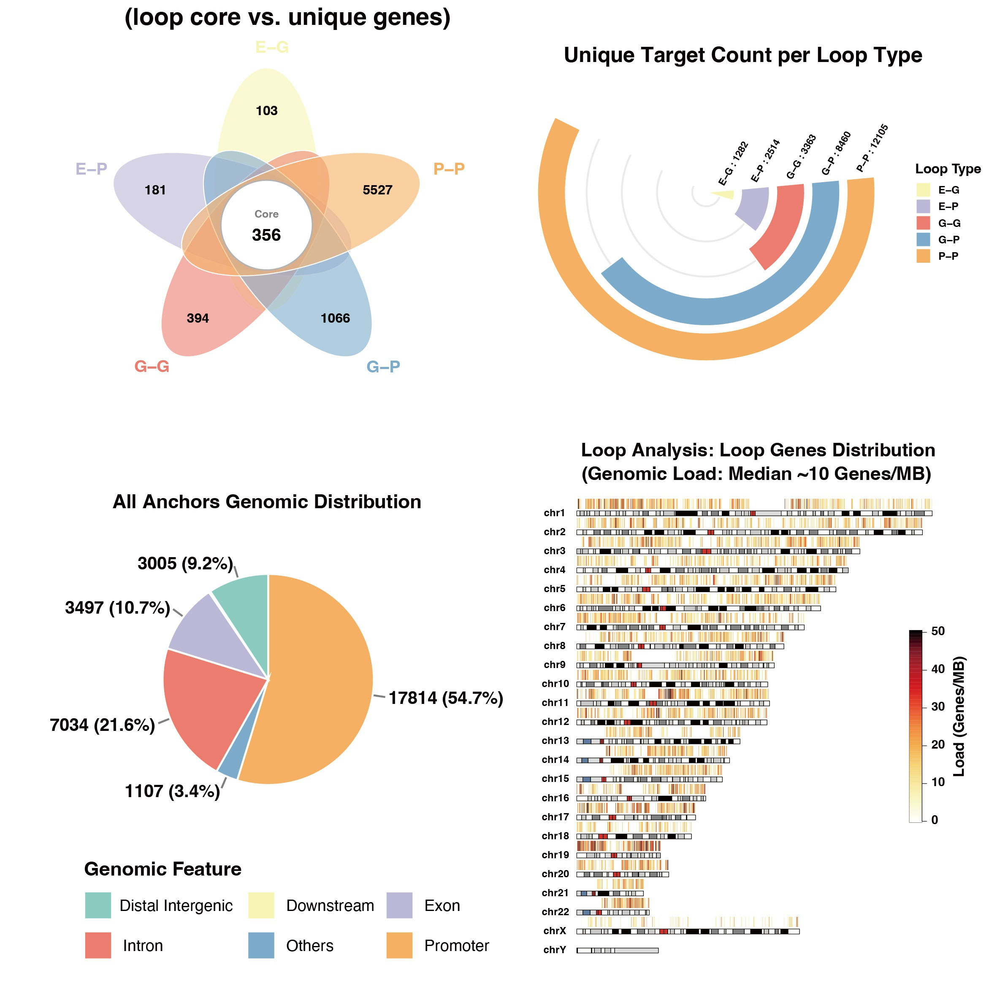
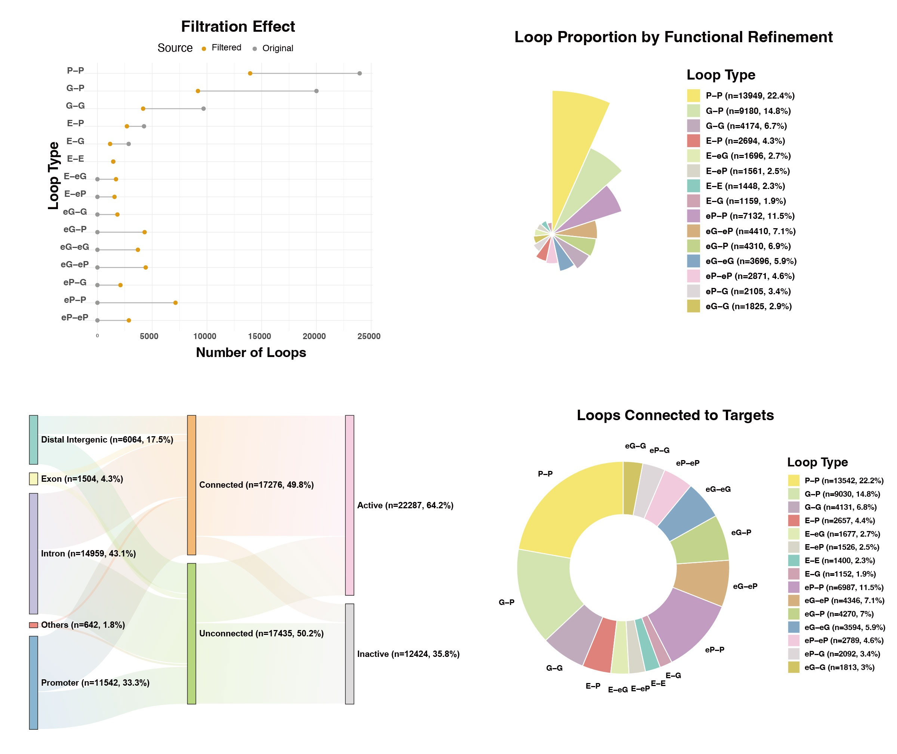
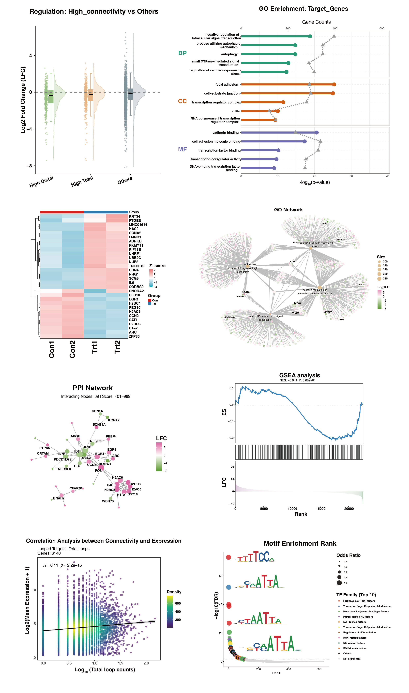
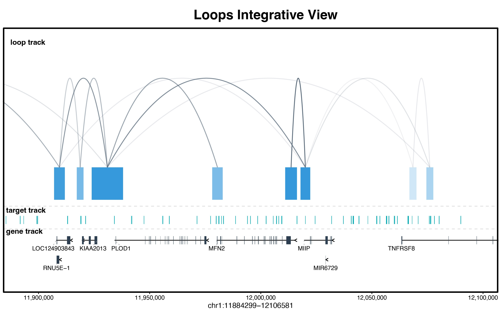

# looplook

An integrative suite for expression-aware target assignment and
functional annotation of chromatin interactions.

[](https://github.com/zying106/looplook/actions/workflows/R-CMD-check.yaml)
[](https://www.gnu.org/licenses/gpl-3.0)
[](#)
[](https://lifecycle.r-lib.org/articles/stages.html#stable)

------------------------------------------------------------------------

## Introduction

Welcome to **`looplook`**, a versatile R/Bioconductor toolkit developed
to **integrate 3D chromatin architecture data** (e.g., HiChIP, ChIA-PET,
Hi-C) with **other tabular omics datasets**, including transcriptomics,
chromatin accessibility, protein-DNA interactions (derived from
ChIP-seq, CUT&Tag, or CUT&RUN), and genetic variants annotated by
genome-wide association studies.

Numerous studies have demonstrated that many distal regulatory elements
physically interact with target gene promoters via 3D chromatin
loopings, thereby regulating the expression of genes located tens of
kilobases to megabases away in the linear genome. However, conventional
annotations tend to assign putative elements (peaks) to their **nearest
genes in cis**, which often fails to reflect biological reality. Hence,
the accurate assignment of non-coding genetic variants or orphan peaks
to their cognate target genes remains a major bottleneck in the target
annotation of functional elements. To address this, `looplook`
systematically prioritizes **physical spatial chromatin contacts** to
batch-annotate thousands of regulatory elements at a **genome-wide**,
**high-throughput scale**, thereby identifying their candidate target
genes with high confidence and systematic efficiency.

Beyond its utility as a tool for integrative target annotation,
`looplook` can be used as a **standalone utility for loop analysis** per
se. Even in the absence of auxiliary omics data, it systematically
annotates the 3D chromatin interactome itself, **classifying complex
spatial topologies** (e.g., Enhancer-Promoter, Promoter-Promoter
interactions) and **quantifying node connectivity** to uncover **dense
regulatory hubs and enhancer cliques** that may represent candidate
regulatory domains driving cell-type-specific transcriptional programs.

------------------------------------------------------------------------

## Installation

`looplook` extensively leverages the Bioconductor ecosystem for **robust
genomic arithmetic and annotation**. To ensure optimal compatibility,
please ensure your **system environment** is fully up to date prior to
installation:

``` r

# Installation from GitHub
if (!requireNamespace("BiocManager", quietly = TRUE)) install.packages("BiocManager")
BiocManager::install("zying106/looplook")
```

------------------------------------------------------------------------

## Detailed Workflow & Core Modules

### Module 1: Data Consolidation & Preprocessing

In 3D genomics analyses, individual replicates typically exhibit
**certain degrees of inconsistency or noise**. The
`consolidate_chromatin_loops` function serves as the foundational
data-cleaning module, merging multiple replicates into a **standardized,
unified 3D chromatin interaction coordinate framework**.

**Key Parameters:**

- **`mode`**: Defines the overarching merging algorithm. The
  **`"consensus"`** mode (recommended) **employs graph-based connected
  component analysis** to cluster nearby chromatin loop anchors across
  biological/technical samples. The **`"intersect"`** mode applies
  strict reference-based filtering to retain only overlapping
  interactions, while the **`"union"`** mode retains all detected
  interactions for **exploratory pan-tissue analyses**.
- **`min_raw_score` & `min_score`** (The Dual-Filter): `min_raw_score`
  acts as a **pre-filter** applied to individual BEDPE files before
  clustering (e.g., removing singleton noise to help reduce
  computational memory overhead). `min_score` serves as a
  **post-filter** applied to the final merged chromatin interactome to
  improve confidence. In `"consensus"` and `"union"` modes, the
  representative score is **replicate-balanced**: the package first
  averages clustered loop scores within each replicate, then averages
  across replicates, so one replicate with denser loop calls does not
  dominate the final score.
- **`gap`**: Defines the **maximum spatial distance** (in base pairs)
  allowed between loop anchors for consideration as part of the same
  physical cluster.
- **`blacklist_species`**: Automatically excludes chromatin loops
  overlapping with high-variance, artifact-prone genomic regions (e.g.,
  centromeres, telomeres) by integrating the official ENCODE blacklist
  for specified species (e.g., `"hg38"`, `"mm10"`).
- **`region_of_interest`**: Accepts an **auxiliary BED file** (e.g., a
  specific disease-associated locus or ChIP-seq peak set) to filter for
  loops with physical connectivity to the target genomic region.

``` r

library(looplook)
out_dir <- tempdir()

f1 <- system.file("extdata", "example_loops_1.bedpe", package = "looplook")
f2 <- system.file("extdata", "example_loops_2.bedpe", package = "looplook")

consensus_global <- consolidate_chromatin_loops(
  files = c(f1, f2),
  mode = "consensus",
  gap = 1000,
  out_file = file.path(out_dir, "consensus_loops.bedpe")
)
```

### Module 2: 3D-Guided Peak Annotation & Mapping

This module serves as the **core target mapping engine**. It resolves
locus assignment conflicts through a rigorous hierarchical pipeline:
Functional Biotype Prioritization → Expression Filtering (within
selected tier) → Co-Dominant Expression Tiebreaker (retains all genes
within 10% of max expression).

**Key Parameters:**

- **`target_bed`**: pecifies the **auxiliary genomic features of
  interest** (e.g., GWAS SNPs, ATAC-seq peaks, or transcription factor
  binding sites) that require spatial target gene assignment.
- **`expr_matrix_file` & `sample_columns`**: Providing an RNA-seq matrix
  allows the engine to activate the Expression Pre-filter and Tiebreaker
  logic, drastically reducing false-positive gene assignments in
  **genomic regions harboring multiple genes**.
- **`neighbor_hop`**: An advanced topological parameter for 3D chromatin
  interactome network traversal. Target gene assignment uses
  `neighbor_hop + 1` graph steps to capture genes at opposite anchors. A
  value of 0 restricts loop topology to direct contacts (target genes
  searched within 1-hop); a value of 1 (Hub Mode) extends both to
  secondary network effects.
- **`tss_region`**: Defines the **spatial boundary of gene promoters**
  relative to the Transcription Start Site (TSS).

``` r

# Annotate chromatin loops and map features to target genes via 3D contacts
# When TxDb/OrgDb are installed, runs the full pipeline; otherwise loads pre-computed result
if (requireNamespace("TxDb.Hsapiens.UCSC.hg38.knownGene", quietly = TRUE) &&
    requireNamespace("org.Hs.eg.db", quietly = TRUE)) {
  bedpe_file <- system.file("extdata", "example_loops_1.bedpe", package = "looplook")
  atac_path  <- system.file("extdata", "example_peaks.bed",       package = "looplook")
  expr_path  <- system.file("extdata", "example_tpm.txt",         package = "looplook")

  res_integrated <- annotate_peaks_and_loops(
    bedpe_file       = bedpe_file,          # Chromatin loops (BEDPE)
    target_bed       = atac_path,           # Genomic features to map
    expr_matrix_file = expr_path,           # RNA-seq expression matrix
    sample_columns   = c("con1", "con2"),   # Samples for baseline expression
    species          = "hg38",
    neighbor_hop     = 0,                   # Direct contacts only
    hub_percentile   = 0.95,                # Top 5% as regulatory hubs
    out_dir          = out_dir,
    project_name     = "HiChIP_Integrative"
  )
} else {
  tmp <- new.env()
  load(system.file("extdata", "analysis_results.RData", package = "looplook"), envir = tmp)
  res_integrated <- tmp[[ls(tmp)[1]]]
}
```

**Output Data Dictionary: The Comprehensive 3D Spatial Catalog**

The module systematically exports a multi-layered tabular catalog (e.g.,
`*_Basic_Results.xlsx`) detailing the spatial interactome:

- **Integrative Target Mapping (`target_annotation`)** Delineates the
  spatial coverage of genomic variants/features inputted by the user. It
  separates strict loop-derived columns (`Regulated_promoter_genes`,
  `Assigned_Target_Genes`) from `*_Filled` fallback columns, and records
  provenance through `Regulated_promoter_Evidence`,
  `Regulated_promoter_Fallback_Evidence`, and the long-format
  `target_gene_links` table. This keeps promoter-supported loop targets,
  historical assigned targets, and nearest-gene fallback choices
  traceable rather than conflated.

- **3D Network Architecture (`loop_annotation`)** Resolves the
  biological syntax of the structural interactome. It classifies
  topological interactions (loop_type, e.g., E-P, P-P) and distinguishes
  biologically relevant `Putative_Target_Genes` from the broader, raw
  physical interaction footprints (`All_Anchor_Genes`).

- **Topological Hub Detection** Quantifies structural node degrees
  (e.g., `n_Linked_Promoters`, `n_Linked_Distal`) to rigorously
  deconstruct the 3D interactome from two complementary perspectives:
  **`promoter_centric_stats`**: Identifies core target genes regulated
  by **complex regulatory architectures** (e.g., enhancer arrays or
  transcription factories), while **`distal_element_stats`** highlights
  high-connectivity non-coding regions to facilitate the discovery of
  putative enhancer cliques.



*Figure 1: **Representative outputs of 3D-Guided Annotation.** This
composite plot displays a curated subset of the automated profiling
suite, featuring macro-scale chromosomal ideograms and topological
overlap analysis of the annotated 3D interactome.*

### Module 3: Expression-Aware Refinement

Physical proximity is a structural prerequisite, but not a direct proxy
for active **transcriptional regulation**. This module integrates
quantitative transcriptome data to annotate each loop with
expression-aware functional status. All structural loops are preserved;
the pipeline reclassifies silent anchors (P to eP, G to eG), flags which
loops belong to the high-confidence functional subset
(`Retained_In_Functional_Network`), and exposes `Refinement_Action` for
transparent interpretation.

**Key Parameters:**

- `threshold` & `unit_type`: Defines the quantitative expression cutoff
  (e.g., `threshold = 1.0`, `unit_type = "TPM"`); genes with expression
  \>= `threshold` are considered active. This parameter enables downward
  compatibility with various normalization methods.
- `reclassify_by_expression`: When enabled (`TRUE`), **transcriptionally
  silent promoters** are not simply discarded; instead, they are
  biologically reclassified to enhancer-like regulatory elements. This
  correction refines the **regulatory topology** (e.g., reclassifying a
  functionally silent **P-P** loop into a curated **eP-P** loop).

``` r

expr_path <- system.file("extdata", "example_tpm.txt", package = "looplook")

refined_res <- refine_loop_anchors_by_expression(
  annotation_res = res_integrated,
  expr_matrix_file = expr_path,
  sample_columns = c("con1", "con2"),
  threshold = 1,
  unit_type = "TPM",
  reclassify_by_expression = TRUE,
  out_dir = out_dir,
  project_name = "Refined_Network"
)
```

**Output Data Dictionary: The Functionally Active Regulome** Following
transcriptome integration, the refined tabular outputs represent a
high-confidence, functionally active subset of the initial 3D chromatin
interactome. The **key features** of these output are as follows:

- **Expression-Aware Refinement**: All structural loops are preserved.
  The pipeline annotates each loop with expression-aware functional
  status (`Has_Active_Target`, `Retained_In_Functional_Network`,
  `Refinement_Action`) and provides a high-confidence functional subset
  for downstream analysis, without discarding structural evidence.
- **Dynamic Topological Reclassification**: The topological annotations
  within the `loop_type` are biologically recalibrated. By dynamically
  reclassifying transcriptionally silent promoters (**P**) as
  enhancer-like elements (**eP**), the catalog fundamentally corrects
  the spatial regulatory syntax (e.g., seamlessly transforming a
  transcriptionally silent **P-P** loop into a curated **eP-P**
  interaction axis).
- **Filtered Target Gene Links**: The refined provenance sheet retains
  only peak-gene links still used by the refined target columns and
  appends `Mean_Expression` plus `Passes_Expression_Filter`, so inactive
  Basic-stage links are not carried forward as active refined evidence.

The `eP` and `eG` labels denote expression-inactive promoter- or
gene-body-associated anchors treated as distal-like regulatory anchors
for network syntax. These should not be interpreted as experimentally
validated enhancers without additional epigenomic evidence (e.g.,
ATAC-seq accessibility, H3K27ac enrichment).

**Orthogonal Chromatin Validation.** `looplook` provides
[`validate_epeG_by_chromatin()`](https://zying106.github.io/looplook/reference/validate_epeG_by_chromatin.md)
for testing eP/eG anchors against user-supplied chromatin mark BED files
(ATAC-seq, H3K27ac, H3K4me1, H3K27me3, H3K4me3). Anchors are scored
against ENCODE active-enhancer criteria (gold_standard / high_confidence
/ supported / weak / uncertain). The function can be called standalone,
embedded in
[`refine_loop_anchors_by_expression()`](https://zying106.github.io/looplook/reference/refine_loop_anchors_by_expression.md)
via the `chromatin_beds` parameter (adds a *Chromatin Validation* sheet
to the Excel workbook), or rendered in
[`looplook_report()`](https://zying106.github.io/looplook/reference/looplook_report.md)
HTML output.



*Figure 2: **Representative outputs of Expression-Aware Refinement.** As
shown by the Multi-Omics Sankey Tracking, this curated visualization
dynamically traces the fate of peak through 3D chromatin topological
interactions to their corresponding transcriptionally active target
genes.*

### Module 4: Automated Functional Profiling

This module provides a fully automated, end-to-end multi-omics analysis
pipeline that integrates 3D genomic interactions with transcriptomic
data to unveil the regulatory mechanisms of targets of interest.

**Key Parameters:**

- **`target_source` (The Biological Scope)** Defines the biological
  scope of functional profiling.
  - **`"targets"`**: Focuses exclusively on the putative target genes
    regulated by inputted genomic features (**Peak-Centric mode**).
  - **`"loops"`**: Evaluates the entire 3D interactome independently of
    the inputted genomic features (**Global Network-Centric mode**).
- **`target_mapping_mode`** Controls the stringency of 3D target
  assignment. **`"all"`** accepts broad 3D target regulation, while
  **`"promoter"`** is highly stringent, requiring 3D loops to explicitly
  anchor at canonical promoter regions, excluding distal E-G
  connections.
- **`include_Filled` (The Stringency Toggle)** Adjusts the stringency of
  annotation integration.
  - **`TRUE` (Hybrid Mode)**: Utilizes the comprehensively merged
    annotation, prioritizing 3D loop-derived target genes while
    **rescuing unlooped genomic elements** by assigning them to their
    nearest linear genes.
  - **`FALSE` (Pure Spatial Mode)**: Strictly isolates and analyzes only
    the **3D interactome**.
- **`use_nearest_gene` (The Control)** Serves as a **classical baseline
  reference**. If set to `TRUE`, the engine bypasses 3D spatial topology
  and strictly assigns genomic features to their nearest linear genes,
  facilitating a direct comparison to demonstrate the **novel functional
  insights** gained from 3D-guided mapping.

``` r

diff_path <- system.file("extdata", "example_deg.txt", package = "looplook")
meta_path <- system.file("extdata", "example_coldata.txt", package = "looplook")

res_profile <- profile_target_genes(
  annotation_res = refined_res,
  diff_file = diff_path,
  lfc_col = "log2FoldChange",
  expr_matrix_file = expr_path,
  metadata_file = meta_path,
  target_source = c("loops", "targets"),
  target_mapping_mode = "all",
  include_Filled = TRUE,
  use_nearest_gene = FALSE,
  project_name = "Functional_Profiling",
  run_motif = FALSE,
  run_go = FALSE,
  run_ppi = FALSE
)
```



*Figure 3: **Representative outputs of Functional Profiling.** This
curated composite highlights Divergent Concept Networks and Asymmetric
Motif Signatures, offering a partial glimpse into the downstream
visualizations that decode the trans-regulatory logic of the spatial
hubs.*

### Module 5: IGV-Style Track Visualization

This module precisely renders the **local** 3D chromatin spatial
interactome through a multi-tiered genomic browser-style visualization
interface, similar to the layout of the `Integrative Genomics Viewer`
(IGV).

**Key Parameters:**

- **`score_to_alpha`** Logical parameter. If `TRUE`, it maps
  quantitative **chromatin interaction scores** to the alpha
  (transparency) channel of the Bezier arcs, enabling visual
  differentiation of interaction strength.
- **`species`** Specifies the **organism of interest**, directing the
  function to automatically load the corresponding `TxDb` and `OrgDb`
  Bioconductor packages. This ensures **precise rendering of gene
  tracks**, including exon-intron structures and strand directionality.

``` r

bedpe_path <- system.file("extdata", "example_loops_1.bedpe", package = "looplook")
bed_path <- system.file("extdata", "example_peaks.bed", package = "looplook")

track_plot <- plot_peaks_interactions(
  bedpe_file = bedpe_path,
  target_bed = bed_path,
  chr = "chr1",
  from = 11884299,
  to = 12106581,
  species = "hg38"
)
```



*Figure 4: Integrative genomic browser view displaying 3D chromatin
loops, genomic regions, and directional gene models.*

------------------------------------------------------------------------

### One-Click Parameterised Report

To facilitate intuitive data exploration and result interpretation, an
integrated HTML report can be compiled to encapsulate the complete
analytical workflow (annotation, refinement, and profiling), presenting
the outputs in a structured and accessible format.

``` r

# One-click report (renders a standalone HTML via nested rmarkdown)
looplook::looplook_report(
  bedpe_file = system.file("extdata", "example_loops_1.bedpe", package = "looplook"),
  target_bed = system.file("extdata", "example_peaks.bed", package = "looplook"),
  expr_matrix_file = system.file("extdata", "example_tpm.txt", package = "looplook"),
  diff_file = system.file("extdata", "example_deg.txt", package = "looplook"),
  metadata_file = system.file("extdata", "example_coldata.txt", package = "looplook"),
  project_name = "My HiChIP Study"
)
```

The report is also available from the RStudio menu: **File → New File →
R Markdown → From Template → looplook Report**.

------------------------------------------------------------------------

## Contact

**Ying ZHANG** Zhejiang University Email: <12207129@zju.edu.cn>

For bug reports, feature requests, or questions regarding the package,
please open an issue at the [looplook GitHub
repository](https://github.com/zying106/looplook/issues).

------------------------------------------------------------------------

## Resources

- **Package website:** <https://zying106.github.io/looplook/> — full
  documentation, function reference, and vignettes
- **Preprint:** [bioRxiv
  10.64898/2026.04.03.715516](https://www.biorxiv.org/content/10.64898/2026.04.03.715516v1)
  — package manuscript and benchmarks

------------------------------------------------------------------------

## Citation

If you use `looplook` in your research, please cite the preprint:

> ZHANG Y, HUANG X, CHEN Y, XU L. **looplook: An integrative suite for
> expression-aware target assignment and functional annotation of
> chromatin interactions.** *bioRxiv*, 2026. DOI:
> [10.64898/2026.04.03.715516](https://www.biorxiv.org/content/10.64898/2026.04.03.715516v1)

``` bibtex
@article{zhang2026looplook,
  title = {looplook: An integrative suite for expression-aware target assignment and functional annotation of chromatin interactions},
  author = {Zhang, Ying and Huang, Xingze and Chen, Ye and Xu, Liang},
  year = {2026},
  journal = {bioRxiv},
  doi = {10.64898/2026.04.03.715516}
}
```

------------------------------------------------------------------------

## Session Information

For reproducibility, `looplook` is developed and tested under the
following environment:

``` R
## ─ Session info ───────────────────────────────────────────────────────────────────────────────────────────────────────────────
##  setting  value
##  version  R version 4.5.1 (2025-06-13)
##  os       macOS Sequoia 15.3
##  system   aarch64, darwin20
##  ui       RStudio
##  language (EN)
##  collate  en_US.UTF-8
##  ctype    en_US.UTF-8
##  tz       Asia/Singapore
##  date     2026-06-12
##  rstudio  2025.05.1+513 Mariposa Orchid (desktop)
##  pandoc   3.9.0.2 @ /opt/homebrew/bin/ (via rmarkdown)
##  quarto   1.6.42 @ /Applications/RStudio.app/Contents/Resources/app/quarto/bin/quarto
## 
## ─ Packages ───────────────────────────────────────────────────────────────────────────────────────────────────────────────────
##  ! package                           * version   date (UTC) lib source
##    abind                               1.4-8     2024-09-12 [1] CRAN (R 4.5.0)
##    AnnotationDbi                     * 1.70.0    2025-04-15 [1] Bioconductor 3.21 (R 4.5.0)
##    AnnotationFilter                    1.32.0    2025-04-15 [1] Bioconductor 3.21 (R 4.5.0)
##    ape                                 5.8-1     2024-12-16 [1] CRAN (R 4.5.0)
##    aplot                               0.2.9     2025-09-12 [1] CRAN (R 4.5.0)
##    askpass                             1.2.1     2024-10-04 [1] CRAN (R 4.5.0)
##    backports                           1.5.0     2024-05-23 [1] CRAN (R 4.5.0)
##    bamsignals                          1.40.0    2025-04-15 [1] Bioconductor 3.21 (R 4.5.0)
##    base64enc                           0.1-3     2015-07-28 [1] CRAN (R 4.5.0)
##    bezier                              1.1.2     2018-12-14 [1] CRAN (R 4.5.0)
##    Biobase                           * 2.68.0    2025-04-15 [1] Bioconductor 3.21 (R 4.5.0)
##    BiocBaseUtils                       1.10.0    2025-04-15 [1] Bioconductor 3.21 (R 4.5.0)
##    BiocCheck                           1.44.2    2025-05-19 [1] Bioconductor 3.21 (R 4.5.0)
##    BiocFileCache                       2.16.2    2025-08-28 [1] Bioconductor 3.21 (R 4.5.1)
##    BiocGenerics                      * 0.54.1    2025-10-09 [1] Bioconductor 3.21 (R 4.5.1)
##    BiocIO                              1.18.0    2025-04-15 [1] Bioconductor 3.21 (R 4.5.0)
##    BiocManager                         1.30.26   2025-06-05 [1] CRAN (R 4.5.0)
##    BiocParallel                        1.42.2    2025-09-11 [1] Bioconductor 3.21 (R 4.5.1)
##    biocViews                           1.76.0    2025-04-15 [1] Bioconductor 3.21 (R 4.5.0)
##    Biostrings                          2.76.0    2025-04-15 [1] Bioconductor 3.21 (R 4.5.0)
##    biovizBase                          1.56.0    2025-04-15 [1] Bioconductor 3.21 (R 4.5.0)
##    bit                                 4.6.0     2025-03-06 [1] CRAN (R 4.5.0)
##    bit64                               4.6.0-1   2025-01-16 [1] CRAN (R 4.5.0)
##    bitops                              1.0-9     2024-10-03 [1] CRAN (R 4.5.0)
##    blob                                1.2.4     2023-03-17 [1] CRAN (R 4.5.0)
##    boot                                1.3-31    2024-08-28 [1] CRAN (R 4.5.1)
##    brio                                1.1.5     2024-04-24 [1] CRAN (R 4.5.0)
##    broom                               1.0.11    2025-12-04 [1] CRAN (R 4.5.2)
##    BSgenome                            1.76.0    2025-04-15 [1] Bioconductor 3.21 (R 4.5.0)
##    BSgenome.Hsapiens.UCSC.hg38         1.4.5     2026-02-15 [1] Bioconductor
##    bslib                               0.9.0     2025-01-30 [1] CRAN (R 4.5.0)
##    cachem                              1.1.0     2024-05-16 [1] CRAN (R 4.5.0)
##    callr                               3.7.6     2024-03-25 [1] CRAN (R 4.5.0)
##    car                                 3.1-3     2024-09-27 [1] CRAN (R 4.5.0)
##    carData                             3.0-5     2022-01-06 [1] CRAN (R 4.5.0)
##    caTools                             1.18.3    2024-09-04 [1] CRAN (R 4.5.0)
##    checkmate                           2.3.3     2025-08-18 [1] CRAN (R 4.5.0)
##    ChIPseeker                          1.44.0    2025-04-15 [1] Bioconductor 3.21 (R 4.5.0)
##    chron                               2.3-62    2024-12-31 [1] CRAN (R 4.5.0)
##    circlize                            0.4.16    2024-02-20 [1] CRAN (R 4.5.0)
##    cli                                 3.6.5     2025-04-23 [1] CRAN (R 4.5.0)
##    clue                                0.3-66    2024-11-13 [1] CRAN (R 4.5.0)
##    cluster                             2.1.8.1   2025-03-12 [1] CRAN (R 4.5.1)
##    clusterProfiler                     4.16.0    2025-04-15 [1] Bioconductor 3.21 (R 4.5.0)
##    codetools                           0.2-20    2024-03-31 [1] CRAN (R 4.5.1)
##    colorspace                          2.1-2     2025-09-22 [1] CRAN (R 4.5.0)
##    commonmark                          2.0.0     2025-07-07 [1] CRAN (R 4.5.0)
##    ComplexHeatmap                      2.26.0    2025-10-29 [1] Bioconductor 3.22 (R 4.5.1)
##    covr                                3.6.5     2025-11-09 [1] CRAN (R 4.5.0)
##    cowplot                             1.2.0     2025-07-07 [1] CRAN (R 4.5.0)
##    crayon                              1.5.3     2024-06-20 [1] CRAN (R 4.5.0)
##    credentials                         2.0.3     2025-09-12 [1] CRAN (R 4.5.0)
##    crosstalk                           1.2.2     2025-08-26 [1] CRAN (R 4.5.0)
##    curl                                7.0.0     2025-08-19 [1] CRAN (R 4.5.0)
##    data.table                          1.17.8    2025-07-10 [1] CRAN (R 4.5.0)
##    data.tree                           1.2.0     2025-08-25 [1] CRAN (R 4.5.0)
##    DBI                                 1.2.3     2024-06-02 [1] CRAN (R 4.5.0)
##    dbplyr                              2.5.1     2025-09-10 [1] CRAN (R 4.5.0)
##    DelayedArray                        0.34.1    2025-04-17 [1] Bioconductor 3.21 (R 4.5.0)
##    desc                                1.4.3     2023-12-10 [1] CRAN (R 4.5.0)
##    devtools                            2.4.6     2025-10-03 [1] CRAN (R 4.5.0)
##    dichromat                           2.0-0.1   2022-05-02 [1] CRAN (R 4.5.0)
##    digest                              0.6.37    2024-08-19 [1] CRAN (R 4.5.0)
##    DirichletMultinomial                1.50.0    2025-04-15 [1] Bioconductor 3.21 (R 4.5.0)
##    distributional                      0.6.0     2026-01-14 [1] CRAN (R 4.5.2)
##    doParallel                          1.0.17    2022-02-07 [1] CRAN (R 4.5.0)
##    DOSE                                4.2.0     2025-04-15 [1] Bioconductor 3.21 (R 4.5.0)
##    dotCall64                           1.2       2024-10-04 [1] CRAN (R 4.5.0)
##    dplyr                               1.1.4     2023-11-17 [1] CRAN (R 4.5.0)
##    DT                                  0.34.0    2025-09-02 [1] CRAN (R 4.5.0)
##    ellipsis                            0.3.2     2021-04-29 [1] CRAN (R 4.5.0)
##    enrichplot                          1.28.4    2025-07-14 [1] Bioconductor 3.21 (R 4.5.1)
##    ensembldb                           2.32.0    2025-04-15 [1] Bioconductor 3.21 (R 4.5.0)
##    evaluate                            1.0.5     2025-08-27 [1] CRAN (R 4.5.0)
##    farver                              2.1.2     2024-05-13 [1] CRAN (R 4.5.0)
##    fastmap                             1.2.0     2024-05-15 [1] CRAN (R 4.5.0)
##    fastmatch                           1.1-6     2024-12-23 [1] CRAN (R 4.5.0)
##    fgsea                               1.34.2    2025-07-10 [1] Bioconductor 3.21 (R 4.5.1)
##    fields                              17.1      2025-09-08 [1] CRAN (R 4.5.0)
##    filelock                            1.0.3     2023-12-11 [1] CRAN (R 4.5.0)
##    foreach                             1.5.2     2022-02-02 [1] CRAN (R 4.5.0)
##    foreign                             0.8-90    2025-03-31 [1] CRAN (R 4.5.1)
##    Formula                             1.2-5     2023-02-24 [1] CRAN (R 4.5.0)
##    fs                                  1.6.6     2025-04-12 [1] CRAN (R 4.5.0)
##    generics                          * 0.1.4     2025-05-09 [1] CRAN (R 4.5.0)
##    GenomeInfoDb                        1.44.3    2025-09-18 [1] Bioconductor 3.21 (R 4.5.1)
##    GenomeInfoDbData                    1.2.14    2025-10-19 [1] Bioconductor
##    GenomicAlignments                   1.44.0    2025-04-15 [1] Bioconductor 3.21 (R 4.5.0)
##    GenomicFeatures                     1.60.0    2025-04-15 [1] Bioconductor 3.21 (R 4.5.0)
##    GenomicRanges                       1.60.0    2025-04-15 [1] Bioconductor 3.21 (R 4.5.0)
##    gert                                2.1.5     2025-03-25 [1] CRAN (R 4.5.0)
##    GetoptLong                          1.1.0     2025-11-28 [1] CRAN (R 4.5.2)
##    ggdist                              3.3.3     2025-04-23 [1] CRAN (R 4.5.0)
##    ggforce                             0.5.0     2025-06-18 [1] CRAN (R 4.5.0)
##    ggfun                               0.2.0     2025-07-15 [1] CRAN (R 4.5.0)
##    ggplot2                             4.0.0     2025-09-11 [1] CRAN (R 4.5.0)
##    ggplotify                           0.1.3     2025-09-20 [1] CRAN (R 4.5.0)
##    ggpointdensity                      0.2.1     2025-11-18 [1] CRAN (R 4.5.2)
##    ggpubr                              0.6.2     2025-10-17 [1] CRAN (R 4.5.0)
##    ggrepel                             0.9.8     2026-03-17 [1] CRAN (R 4.5.2)
##    ggsignif                            0.6.4     2022-10-13 [1] CRAN (R 4.5.0)
##    ggtangle                            0.0.7     2025-06-30 [1] CRAN (R 4.5.0)
##    ggtree                              3.16.3    2025-07-14 [1] Bioconductor 3.21 (R 4.5.1)
##    GlobalOptions                       0.1.2     2020-06-10 [1] CRAN (R 4.5.0)
##    glue                                1.8.0     2024-09-30 [1] CRAN (R 4.5.0)
##    GO.db                               3.21.0    2025-10-19 [1] Bioconductor
##    GOSemSim                            2.34.0    2025-04-15 [1] Bioconductor 3.21 (R 4.5.0)
##    gplots                              3.2.0     2024-10-05 [1] CRAN (R 4.5.0)
##    graph                               1.86.0    2025-04-15 [1] Bioconductor 3.21 (R 4.5.0)
##    gridExtra                           2.3       2017-09-09 [1] CRAN (R 4.5.0)
##    gridGraphics                        0.5-1     2020-12-13 [1] CRAN (R 4.5.0)
##    gson                                0.1.0     2023-03-07 [1] CRAN (R 4.5.0)
##    gsubfn                              0.7       2018-03-16 [1] CRAN (R 4.5.0)
##    gtable                              0.3.6     2024-10-25 [1] CRAN (R 4.5.0)
##    gtools                              3.9.5     2023-11-20 [1] CRAN (R 4.5.0)
##    hash                                2.2.6.3   2023-08-19 [1] CRAN (R 4.5.0)
##    Hmisc                               5.2-4     2025-10-05 [1] CRAN (R 4.5.0)
##    htmlTable                           2.4.3     2024-07-21 [1] CRAN (R 4.5.0)
##    htmltools                           0.5.8.1   2024-04-04 [1] CRAN (R 4.5.0)
##    htmlwidgets                         1.6.4     2023-12-06 [1] CRAN (R 4.5.0)
##    httr                                1.4.7     2023-08-15 [1] CRAN (R 4.5.0)
##    httr2                               1.2.1     2025-07-22 [1] CRAN (R 4.5.0)
##    igraph                              2.2.0     2025-10-13 [1] CRAN (R 4.5.0)
##    InteractionSet                      1.36.1    2025-05-08 [1] Bioconductor 3.21 (R 4.5.0)
##    IRanges                           * 2.42.0    2025-04-15 [1] Bioconductor 3.21 (R 4.5.0)
##    iterators                           1.0.14    2022-02-05 [1] CRAN (R 4.5.0)
##    JASPAR2020                          0.99.10   2026-02-15 [1] Bioconductor
##    jquerylib                           0.1.4     2021-04-26 [1] CRAN (R 4.5.0)
##    jsonlite                            2.0.0     2025-03-27 [1] CRAN (R 4.5.0)
##    karyoploteR                         1.34.2    2025-06-09 [1] Bioconductor 3.21 (R 4.5.0)
##    KEGGREST                            1.48.1    2025-06-19 [1] Bioconductor 3.21 (R 4.5.1)
##    KernSmooth                          2.23-26   2025-01-01 [1] CRAN (R 4.5.1)
##    knitr                               1.51      2025-12-20 [1] CRAN (R 4.5.2)
##    lattice                             0.22-7    2025-04-02 [1] CRAN (R 4.5.1)
##    lazyeval                            0.2.2     2019-03-15 [1] CRAN (R 4.5.0)
##    lifecycle                           1.0.4     2023-11-07 [1] CRAN (R 4.5.0)
##  P looplook                          * 0.99.14   2026-06-11 [?] Bioconductor
##    magick                              2.9.0     2025-09-08 [1] CRAN (R 4.5.0)
##    magrittr                            2.0.4     2025-09-12 [1] CRAN (R 4.5.0)
##    maps                                3.4.3     2025-05-26 [1] CRAN (R 4.5.0)
##    MASS                                7.3-65    2025-02-28 [1] CRAN (R 4.5.1)
##    Matrix                              1.7-3     2025-03-11 [1] CRAN (R 4.5.1)
##    MatrixGenerics                      1.20.0    2025-04-15 [1] Bioconductor 3.21 (R 4.5.0)
##    matrixStats                         1.5.0     2025-01-07 [1] CRAN (R 4.5.0)
##    memoise                             2.0.1     2021-11-26 [1] CRAN (R 4.5.0)
##    motifmatchr                         1.30.0    2025-04-15 [1] Bioconductor 3.21 (R 4.5.0)
##    networkD3                           0.4.1     2025-04-14 [1] CRAN (R 4.5.0)
##    nlme                                3.1-168   2025-03-31 [1] CRAN (R 4.5.1)
##    nnet                                7.3-20    2025-01-01 [1] CRAN (R 4.5.1)
##    openssl                             2.3.4     2025-09-30 [1] CRAN (R 4.5.0)
##    openxlsx                            4.2.8.1   2025-10-31 [1] CRAN (R 4.5.0)
##    org.Hs.eg.db                      * 3.21.0    2025-10-20 [1] Bioconductor
##    otel                                0.2.0     2025-08-29 [1] CRAN (R 4.5.0)
##    patchwork                           1.3.2     2025-08-25 [1] CRAN (R 4.5.0)
##    pillar                              1.11.1    2025-09-17 [1] CRAN (R 4.5.0)
##    pkgbuild                            1.4.8     2025-05-26 [1] CRAN (R 4.5.0)
##    pkgconfig                           2.0.3     2019-09-22 [1] CRAN (R 4.5.0)
##    pkgload                             1.4.1     2025-09-23 [1] CRAN (R 4.5.0)
##    plotrix                             3.8-4     2023-11-10 [1] CRAN (R 4.5.0)
##    plyr                                1.8.9     2023-10-02 [1] CRAN (R 4.5.0)
##    png                                 0.1-9     2026-03-15 [1] CRAN (R 4.5.2)
##    polyclip                            1.10-7    2024-07-23 [1] CRAN (R 4.5.0)
##    prettyunits                         1.2.0     2023-09-24 [1] CRAN (R 4.5.0)
##    processx                            3.8.6     2025-02-21 [1] CRAN (R 4.5.0)
##    ProtGenerics                        1.40.0    2025-04-15 [1] Bioconductor 3.21 (R 4.5.0)
##    proto                               1.0.0     2016-10-29 [1] CRAN (R 4.5.0)
##    ps                                  1.9.1     2025-04-12 [1] CRAN (R 4.5.0)
##    purrr                               1.2.1     2026-01-09 [1] CRAN (R 4.5.2)
##    pwalign                             1.4.0     2025-04-15 [1] Bioconductor 3.21 (R 4.5.0)
##    qvalue                              2.40.0    2025-04-15 [1] Bioconductor 3.21 (R 4.5.0)
##    R.methodsS3                         1.8.2     2022-06-13 [1] CRAN (R 4.5.0)
##    R.oo                                1.27.1    2025-05-02 [1] CRAN (R 4.5.0)
##    R.utils                             2.13.0    2025-02-24 [1] CRAN (R 4.5.0)
##    R6                                  2.6.1     2025-02-15 [1] CRAN (R 4.5.0)
##    rappdirs                            0.3.3     2021-01-31 [1] CRAN (R 4.5.0)
##    RBGL                                1.84.0    2025-04-15 [1] Bioconductor 3.21 (R 4.5.0)
##    rcmdcheck                           1.4.0     2021-09-27 [1] CRAN (R 4.5.0)
##    RColorBrewer                        1.1-3     2022-04-03 [1] CRAN (R 4.5.0)
##    Rcpp                                1.1.0     2025-07-02 [1] CRAN (R 4.5.0)
##    RCurl                               1.98-1.17 2025-03-22 [1] CRAN (R 4.5.0)
##    regioneR                            1.40.1    2025-05-29 [1] Bioconductor 3.21 (R 4.5.0)
##    remotes                             2.5.0     2024-03-17 [1] CRAN (R 4.5.0)
##    reshape2                            1.4.4     2020-04-09 [1] CRAN (R 4.5.0)
##    restfulr                            0.0.16    2025-06-27 [1] CRAN (R 4.5.0)
##    rex                                 1.2.1     2021-11-26 [1] CRAN (R 4.5.0)
##    rjson                               0.2.23    2024-09-16 [1] CRAN (R 4.5.0)
##    rlang                               1.2.0     2026-04-06 [1] CRAN (R 4.5.2)
##    rmarkdown                           2.30      2025-09-28 [1] CRAN (R 4.5.0)
##    roxygen2                            7.3.3     2025-09-03 [1] CRAN (R 4.5.0)
##    rpart                               4.1.24    2025-01-07 [1] CRAN (R 4.5.1)
##    rprojroot                           2.1.1     2025-08-26 [1] CRAN (R 4.5.0)
##    Rsamtools                           2.24.1    2025-09-04 [1] Bioconductor 3.21 (R 4.5.1)
##    RSQLite                             2.4.3     2025-08-20 [1] CRAN (R 4.5.0)
##    rstatix                             0.7.3     2025-10-18 [1] CRAN (R 4.5.0)
##    rstudioapi                          0.17.1    2024-10-22 [1] CRAN (R 4.5.0)
##    rtracklayer                         1.68.0    2025-04-15 [1] Bioconductor 3.21 (R 4.5.0)
##    RUnit                               0.4.33.1  2025-06-17 [1] CRAN (R 4.5.0)
##    S4Arrays                            1.8.1     2025-05-29 [1] Bioconductor 3.21 (R 4.5.0)
##    S4Vectors                         * 0.48.0    2025-10-29 [1] Bioconductor 3.22 (R 4.5.1)
##    S7                                  0.2.0     2024-11-07 [1] CRAN (R 4.5.0)
##    sass                                0.4.10    2025-04-11 [1] CRAN (R 4.5.0)
##    scales                              1.4.0     2025-04-24 [1] CRAN (R 4.5.0)
##    seqLogo                             1.74.0    2025-04-15 [1] Bioconductor 3.21 (R 4.5.0)
##    sessioninfo                         1.2.3     2025-02-05 [1] CRAN (R 4.5.0)
##    shape                               1.4.6.1   2024-02-23 [1] CRAN (R 4.5.0)
##    spam                                2.11-1    2025-01-20 [1] CRAN (R 4.5.0)
##    SparseArray                         1.8.1     2025-07-21 [1] Bioconductor 3.21 (R 4.5.1)
##    sqldf                               0.4-11    2017-06-28 [1] CRAN (R 4.5.0)
##    STRINGdb                            2.20.0    2025-04-15 [1] Bioconductor 3.21 (R 4.5.0)
##    stringdist                          0.9.15    2025-01-10 [1] CRAN (R 4.5.0)
##    stringi                             1.8.7     2025-03-27 [1] CRAN (R 4.5.0)
##    stringr                             1.5.2     2025-09-08 [1] CRAN (R 4.5.0)
##    SummarizedExperiment                1.38.1    2025-04-28 [1] Bioconductor 3.21 (R 4.5.0)
##    sys                                 3.4.3     2024-10-04 [1] CRAN (R 4.5.0)
##    testthat                          * 3.3.1     2025-11-25 [1] CRAN (R 4.5.2)
##    TFBSTools                           1.46.0    2025-04-15 [1] Bioconductor 3.21 (R 4.5.0)
##    TFMPvalue                           1.0.0     2026-01-19 [1] CRAN (R 4.5.2)
##    tibble                              3.3.0     2025-06-08 [1] CRAN (R 4.5.0)
##    tidyr                               1.3.1     2024-01-24 [1] CRAN (R 4.5.0)
##    tidyselect                          1.2.1     2024-03-11 [1] CRAN (R 4.5.0)
##    tidytree                            0.4.6     2023-12-12 [1] CRAN (R 4.5.0)
##    treeio                              1.32.0    2025-04-15 [1] Bioconductor 3.21 (R 4.5.0)
##    tweenr                              2.0.3     2024-02-26 [1] CRAN (R 4.5.0)
##    TxDb.Hsapiens.UCSC.hg19.knownGene   3.2.2     2025-10-20 [1] Bioconductor
##    TxDb.Hsapiens.UCSC.hg38.knownGene   3.21.0    2025-10-20 [1] Bioconductor
##    UCSC.utils                          1.4.0     2025-04-17 [1] Bioconductor 3.21 (R 4.5.0)
##    UpSetR                              1.4.0     2019-05-22 [1] CRAN (R 4.5.0)
##    usethis                             3.2.1     2025-09-06 [1] CRAN (R 4.5.0)
##    VariantAnnotation                   1.54.1    2025-05-08 [1] Bioconductor 3.21 (R 4.5.0)
##    vctrs                               0.7.2     2026-03-21 [1] CRAN (R 4.5.2)
##    viridis                             0.6.5     2024-01-29 [1] CRAN (R 4.5.0)
##    viridisLite                         0.4.2     2023-05-02 [1] CRAN (R 4.5.0)
##    withr                               3.0.2     2024-10-28 [1] CRAN (R 4.5.0)
##    xfun                                0.55      2025-12-16 [1] CRAN (R 4.5.2)
##    XML                                 3.99-0.19 2025-08-22 [1] CRAN (R 4.5.0)
##    xml2                                1.4.0     2025-08-20 [1] CRAN (R 4.5.0)
##    xopen                               1.0.1     2024-04-25 [1] CRAN (R 4.5.0)
##    XVector                             0.48.0    2025-04-15 [1] Bioconductor 3.21 (R 4.5.0)
##    yaml                                2.3.10    2024-07-26 [1] CRAN (R 4.5.0)
##    yulab.utils                         0.2.1     2025-08-19 [1] CRAN (R 4.5.0)
##    zip                                 2.3.3     2025-05-13 [1] CRAN (R 4.5.0)
##    zlibbioc                            1.54.0    2025-04-15 [1] Bioconductor 3.21 (R 4.5.0)
## 
##  [1] /Library/Frameworks/R.framework/Versions/4.5-arm64/Resources/library
## 
##  * ── Packages attached to the search path.
##  P ── Loaded and on-disk path mismatch.
## 
## ──────────────────────────────────────────────────────────────────────────────────────────────────────────────────────────────
```
